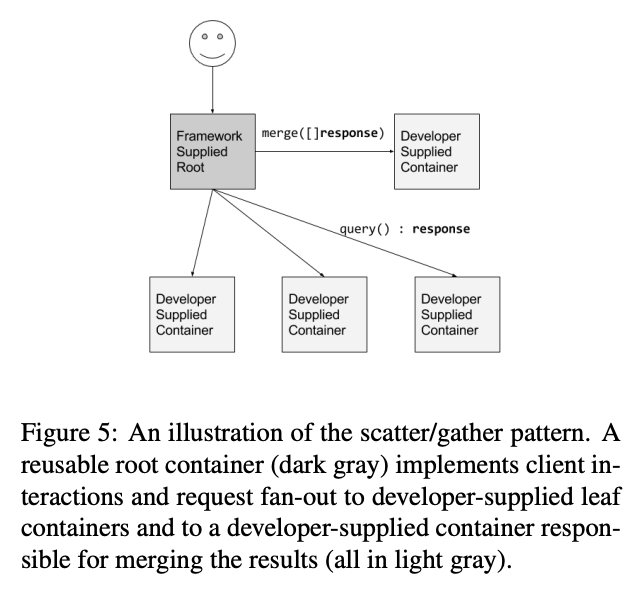

# Design patterns for container-based distributed systems

[link to the paper](https://static.googleusercontent.com/media/research.google.com/en//pubs/archive/45406.pdf)

## single-container management patterns

## single-node, multi-container application patterns

* sidecar: delegate specialized operations
* ambassador: represent the external world to internal usage
* adaptor: represent the internal implementation to the external world
  

## multi-node application patterns

* leader election
* work queue
* scatter / gather

